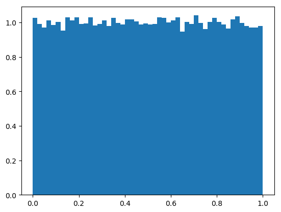
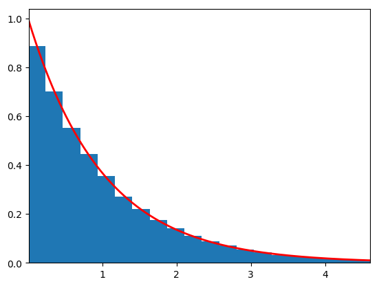
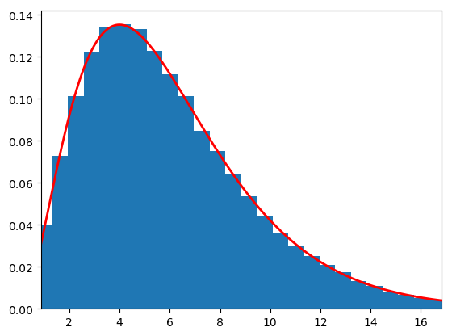
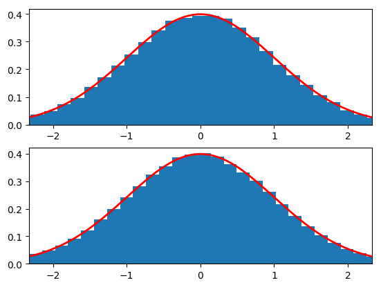
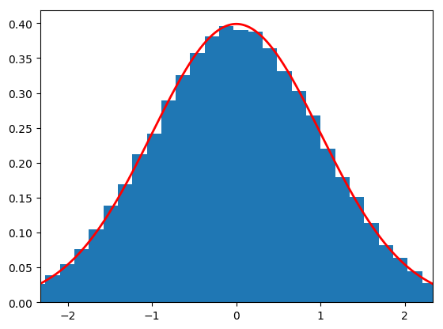
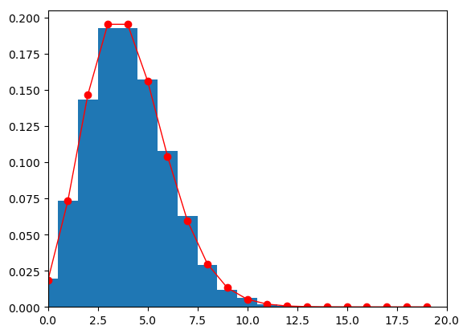
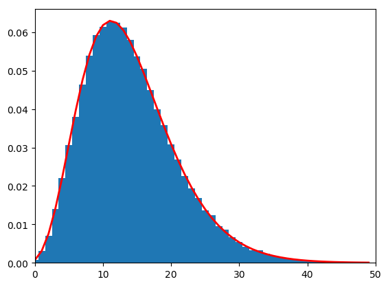
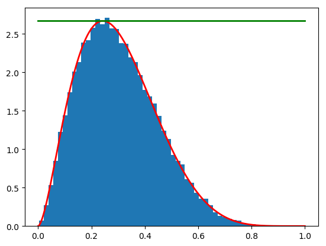

```{r setup, include=FALSE}
knitr::opts_chunk$set(echo = TRUE,warning = FALSE,message = FALSE)
library(ggplot2)
library(reshape2)
library(dplyr)
theme_set(theme_bw())
```

ParticleFilterに到達する前の重点サンプリングやPMCMC(Particle Marcoh chain monte carlo)のもとになっているMCMCの理論について  
いろいろと怪しい部分があったのでまとめる。  
このMarkdownは主に二章のサンプリング関係について

## 参考文献

[Rによるモンテカルロ法入門](https://pub.maruzen.co.jp/book_magazine/book_data/search/9784621065273.html)  
[人工知能に関する断創録](http://aidiary.hatenablog.com/entry/20140620/1403272044)

# 逆変換法
乱数を得る手法の一つ。
[0,1]区間の一様分布から得られた乱数（一様乱数）を変換することで任意の確率分布に従う乱数を得る手法。
このとき必要となるのは変換先の確率分布の累積分布関数
(cumulative distribution function:cdf)  
逆変換法は、累積分布関数$F_X$の逆関数$F^{−1}_X$を使って一様乱数を変換する。
下の例は、一様乱数を指数分布の乱数に変換した例。

指数分布の累積分布関数の逆関数が
$$
\displaystyle x = - \frac{1}{\lambda} \log (1 - u)
$$
```{r}
Nsim <- 10^4
U <- runif(Nsim)
X <- -log(U)
Y = rexp(Nsim)
plot_d <- data.frame(Uniform=X,R=Y)
ggplot(plot_d %>% melt,aes(x=value))+geom_histogram(aes(fill=variable))+facet_grid(.~variable)
```
```{python}
# 逆変換法で一様分布から指数分布を得る
import numpy as np
import matplotlib.pyplot as plt
import scipy.stats

nbins = 50

# 指数分布のパラメータ（scale = 1/lambda）
scale = 1.0

# 逆変換法で一様乱数から指数分布の乱数を得る
np.random.seed()
N = 100000
U = scipy.stats.uniform(loc=0.0, scale=1.0).rvs(size=N)

# 指数分布の累積分布関数の逆関数を用いて変換
X1 = - scale * np.log(1 - U)

# 生成した元の一様乱数を描画
plt.figure(1)
plt.hist(U, nbins, normed=True)
plt.savefig('figure/itiyou.png', bbox_inches='tight')
# 変換した指数分布の乱数と理想的なPDFを描画
plt.figure(2)
rv = scipy.stats.expon(scale=scale)
plt.hist(X1, nbins, normed=True)

x = np.linspace(rv.ppf(0.01), rv.ppf(0.99), 1000)
y = rv.pdf(x)
plt.plot(x, y, 'r-', lw=2)
plt.xlim((rv.ppf(0.01), rv.ppf(0.99)))

#plt.show()
plt.savefig('figure/gyaku.png', bbox_inches='tight')
```



## 証明
$U$ が一様分布に従うことを式で表す$:P(U\leq u)=u$  
（ただし $0\leq u\leq 1$）

ここで，$U\leq u\iff F^{-1}(U)\leq F^{-1}(u)$  
に注意すると上式は$P(F^{-1}(U)\leq F^{-1}(u))=u$となる。

さらに，$F^{-1}(u)=x$ と置くと，
$P(F^{-1}(U)\leq x)=F(x)$

これは確率変数$F^{-1}(U)$が，累積分布関数が$F(x)$であるような確率分布に従うことを表している。

# 一般変換法
密度関数fの分布が、シミュレーションしやすい別の分布に比較的簡単にリンクする場合、
この関係を利用してfの分布から変数をシミュレーションするアルゴリズムを構築できる。


指数分布に特定の変換を施すことで生成できる標準的な分布としてカイ二乗分布、ガンマ分布、ベータ分布などがある。  
ここでは自由度6のカイ二乗分布を生成する。カイ二乗分布の従う分布が以下のように導ける。
$$
\displaystyle Y = 2 \sum_{j=1}^\nu X_j \sim \chi_{2 \nu}^2
$$

```{r}
U <- runif(3*10^4)
U <- matrix(data = U,nrow = 3)
X <- -log(U)
X <- 2*apply(X,2,sum)
Y <- rchisq(3*10^4,df=6)
plot_d <- data.frame(Uniform=X,R=Y)
ggplot(plot_d %>% melt,aes(x=value))+geom_histogram(aes(fill=variable))+facet_grid(.~variable)
```


```{python}
# カイ二乗分布に従う乱数を指数乱数から生成
import numpy as np
from scipy.stats import uniform, chi2
import matplotlib.pyplot as plt

nbins = 50

# カイ二乗分布のパラメータ（自由度: degrees of freedom）
# この方法では偶数のみ
df = 6
if df % 2 != 0:
    print(u"ERROR: 自由度は偶数のみ")
    exit(0)

nu = int(df / 2)

# 逆変換法で一様乱数を指数乱数に変換
# 1つのカイ二乗乱数を得るためにはnu個の指数乱数が必要なので
# 行列化して和を取りやすくする
np.random.seed()
N = 100000
rv = uniform(loc=0.0, scale=1.0)
U = rv.rvs(nu * N).reshape((nu, -1))
X = - np.log(1 - U)

# 指数乱数からカイ二乗乱数を得る
# 各列を足しあわせて1つのカイ二乗乱数を得る
Y = 2 * np.sum(X, axis=0)

# 変換したカイ二乗分布の乱数とpdfを描画
plt.figure(1)
plt.hist(Y, nbins, normed=True)
rv = chi2(df=df)
x = np.linspace(rv.ppf(0.01), rv.ppf(0.99), 1000)
y = rv.pdf(x)
plt.plot(x, y, 'r-', lw=2)
plt.xlim((rv.ppf(0.01), rv.ppf(0.99)))

plt.savefig('figure/ippan.png', bbox_inches='tight')
```


# Box-Muller法
2つの一様乱数から標準正規分布$N(0,1)$に従う2つの乱数を生成するアルゴリズム。$U_1$と$U_2$が独立同分布の$U_{[0,1]}$とすると、次の2つの変数
$$
X_1 = \sqrt{-2 \log (U_1)} \cos (2 \pi U_2)\\
X_2 = \sqrt{-2 \log (U_1)} \sin (2 \pi U_2)
$$
は独立同分布の$N_{[0,1]}$になる。  　　
本にコードがなかったのでR版は省略

```{python}
# Box-Mullerアルゴリズムを用いて標準正規分布N(0,1)に従う乱数を生成
import numpy as np
from scipy.stats import uniform, norm
import matplotlib.pyplot as plt

# 独立した一様分布からそれぞれ一様乱数を生成
np.random.seed()
N = 100000
rv1 = uniform(loc=0.0, scale=1.0)
rv2 = uniform(loc=0.0, scale=1.0)
U1 = rv1.rvs(N)
U2 = rv2.rvs(N)

# Box-Mullerアルゴリズムで正規分布に従う乱数に変換
# 2つの一様分布から2つの標準正規分布が得られる
X1 = np.sqrt(-2 * np.log(U1)) * np.cos(2 * np.pi * U2)
X2 = np.sqrt(-2 * np.log(U1)) * np.sin(2 * np.pi * U2)

# 変換した乱数の分布と標準正規分布の真のpdfを描画
rv = norm(loc=0, scale=1)

# X1の分布
plt.subplot(2, 1, 1)
nbins = 50
plt.hist(X1, nbins, normed=True)
x = np.linspace(rv.ppf(0.01), rv.ppf(0.99), 1000)
y = rv.pdf(x)
plt.plot(x, y, 'r-', lw=2)
plt.xlim((rv.ppf(0.01), rv.ppf(0.99)))

# X2の分布
plt.subplot(2, 1, 2)
plt.hist(X2, nbins, normed=True)
x = np.linspace(rv.ppf(0.01), rv.ppf(0.99), 1000)
y = rv.pdf(x)
plt.plot(x, y, 'r-', lw=2)
plt.xlim((rv.ppf(0.01), rv.ppf(0.99)))

plt.savefig('figure/box.png', bbox_inches='tight')
```



# CLTに基づくアルゴリズム
中心極限定理(CLT: Central Limit Theorem)に基づく近似アルゴリズム   
こちらもPythonのみ  
[-0.5,0.5]の一様乱数12個を足し合わせることで1つの正規乱数を生成している。たぶん去年同じことやった  
これが正規分布になる証明がわかったのでそれも確認
## 証明
中心極限定理によると平均が$\mu$、分散が$sigma^2$で独立同分布iidのn個の確率変数$X_1,X_2,\dots,X_n$ の平均

$S_n=\frac{X_1+X_2+\dots+Xn}{n}$
は、nが大きい場合、正規分布 $N(\mu,\sigma^2/n)$に近づく。
今回は平均$\mu=0$、分散$\sigma^2=1/12$になる一様分布を使っていて確率変数の数はn=12なので、中心極限定理より
$$S_{12}=\frac{1}{12}∑_{i=1}^{12}X_i$$
は、$N(0,1/12^2)$に従う。つまり、
$$12S_{12}=∑_{i=1}^{12}X_i（12個の一様分布の単なる和）$$
は、N(0, 1)の標準正規分布に従う
```{python}
# 中心極限定理（CLT）による正規乱数生成器
import numpy as np
from scipy.stats import uniform, norm
import matplotlib.pyplot as plt

# 独立した一様分布からそれぞれ一様乱数を生成
np.random.seed()
N = 100000

# 12個の一様乱数を使用
K = 12

# (-0.5, 0.5)の一様乱数を生成
rv = uniform(loc=-0.5, scale=1.0)
U = rv.rvs(K * N).reshape((K, -1))

# K個の一様分布の和から正規分布を生成
Z = np.sum(U, axis=0)

# 変換した乱数の分布と標準正規分布の真のpdfを描画
plt.figure(1)
nbins = 50
plt.hist(Z, nbins, normed=True)

rv = norm(loc=0, scale=1)
x = np.linspace(rv.ppf(0.01), rv.ppf(0.99), 1000)
y = rv.pdf(x)
plt.plot(x, y, 'r-', lw=2)
plt.xlim((rv.ppf(0.01), rv.ppf(0.99)))

plt.savefig('figure/CLT.png',bbox_inches='tight')
```


# 離散的な乱数の生成
逆変換法の原理とほとんど同じ

1. $X\sim P_\theta$を生成することを考える。ここで、$P_θ$の台（確率変数の取る値の集合）を自然数とする。
2. $p_0=P_\theta(X\leq0),p_1=P_\theta(X\leq1),p_2=P_\theta(X\leq2),\dots$ を計算する。
3. $U\sim U[0,1]$ を生成し、$X=k \hspace{5mm} if \hspace{3mm} p_{k-1} < U < p_k$ とする。

これで、一様乱数Uから離散分布$P_θ$に従う乱数Xが1つ生成される。実際にポアソン分布に対する乱数生成

```{r}
Nsim <- 10^4;lambda <- 4
spread <- 3*sqrt(lambda)
t <- round(seq(max(0,lambda-spread),lambda+spread,1))
prob <- ppois(t,lambda)
X <- rep(0,Nsim)
for(i in 1:Nsim){
  u <- runif(1)
  X[i] <- t[1] + sum(prob < u)
}
ggplot(data.frame(X),aes(X))+geom_histogram(binwidth = 1)
```

```{python}
# ポアソン分布に従う乱数を累積分布関数から生成
import numpy as np
from scipy.stats import uniform, poisson
import matplotlib.pyplot as plt

# ポアソン分布のパラメータ
lam = 4

# この値まで確率値を計算
K = 20

# サンプリング数
N = 10000

rv = poisson(mu=lam)

# cdfの表を計算
t = np.arange(K)
prob = rv.cdf(t)

X = []
for i in range(N):
    u = uniform.rvs(loc=0, scale=1, size=1)
    # prob < uはcdfがuより小さいときTRUEを返す
    # TRUEは1と解釈されるのでsum()でTRUEの数をカウントして
    # インデックスを求めている
    X.append(np.sum(prob < u))

# ポアソン分布に従う乱数の分布を描画
# hist()のnormed=Trueはバーの積分が1になる確率密度関数になるため離散分布では使えない
# 離散分布ではバーの高さの合計が1になる確率質量関数にする必要がある
# http://stackoverflow.com/questions/3866520/plotting-histograms-whose-bar-heights-sum-to-1-in-matplotlib
plt.figure(1)
nbins = np.arange(-0.5, K, 1.0)
weights = np.ones_like(X) / float(len(X))
plt.hist(X, nbins, weights=weights)
plt.plot(t, rv.pmf(t), 'ro-', lw=1)
plt.xlim((0, K))

plt.savefig('figure/poisson.png',bbox_inches='tight')
```


# 混合分布から乱数を生成
確率分布fが別の確率分布gとpの混合分布として次のように書ける
$$\displaystyle f(x) = \int_Y g(x|y) p(y) dy$$
たとえば、スチューデントのt分布fは、カイ二乗分布pと正規分布gという二つの分布の混合で表せる　　
負の二項分布はガンマ分布とポアソン分布で表せる

1. 分布p(y)に従う乱数yを生成し、
2. 分布g(x|y)に従う乱数xを生成すると、
3. xは分布f(x)に従う乱数になっている

```{r}
Nsim <- 10^4
n <- 6;p <- 0.3
y <- rgamma(Nsim, n, rate=p/(1-p))
x <- rpois(Nsim, y)
lines <- dnbinom(1:50,n,p)
ggplot() + geom_histogram(data.frame(point = x),mapping=aes(x=point), binwidth=1, fill="skyblue") + geom_line(data.frame(x=c(1:50),lines),mapping=aes(x=x,y=lines*(10^4)),colour="blue",size=2)
```


```{python}
# 混合分布によってガンマ乱数から負の二項分布に従う乱数を生成
# Y〜Gamma(n,(1-p)/p) && X|y〜Poisson(y) => X〜Neg(n,p)
import numpy as np
from scipy.stats import gamma, poisson, nbinom
import matplotlib.pyplot as plt

# 負の二項分布のパラメータ
n = 6
p = 0.3

# この値まで確率値を計算
K = 50

# サンプリング数
N = 100000

# ガンマ分布に従う乱数を生成
Y = gamma(a=n, scale=(1-p)/p).rvs(size=N)

# 生成したガンマ分布の乱数をパラメータに持つポアソン分布から乱数を生成
X = poisson(mu=Y).rvs(size=N)

# scipy.statsの機能で負の二項分布のパラメータ生成
# X = nbinom(n=n, p=p).rvs(N)

plt.figure(1)
weights = np.ones_like(X) / float(len(X))
nbins = np.arange(-0.5, K, 1.0)
plt.hist(X, nbins, weights=weights)
rv = nbinom(n=n, p=p)
t = np.arange(K)
plt.plot(t, rv.pmf(t), 'r-', lw=2)
plt.xlim((0, K))
plt.savefig('figure/kongou.png',bbox_inches='tight')
```


# 受理・棄却法
別名、棄却サンプリング（rejection sampling）による乱数生成  
この方法を使うと事実上あらゆる分布（特定の名前がついていない分布を含めて）から乱数を生成できるようになる。  
受理・棄却法では目標分布fと提案分布gという二つの分布を使う。
目標分布fにしたがう乱数を生成するのが最終目的だが、目標分布fの乱数は直接生成できないため代わりに提案分布gの乱数を生成し、
ある条件を満たす場合だけ生成した乱数を目標分布fの乱数とみなすというアプローチが受理・棄却法。条件を満たさない乱数は単に捨てられる。

このとき、目標分布fと提案分布gの関係にはいくつか仮定がある。

- 目標分布fにしたがう乱数は直接生成できない
- 逆に提案分布gにしたがう乱数は生成できる
- 目標分布fと提案分布gの確率密度関数は既知
- すべてのxについて$f(x)\leq Mg(x)$となるMが存在する

最後の条件は少しわかりにくいが、目標分布が提案分布をM倍した分布にすっぽり覆われていることを意味する。去年やって理解しているので、これ以上深追いしない  

アルゴリズム：受理・棄却法
以下の手順で生成した乱数 X は目標分布fにしたがう乱数となる。

- 提案分布gにしたがう乱数Yを生成する
- [0,1] の一様乱数Uを生成する
- $UMg(Y)\leq f(Y)$であればYをXとして受理
- そうでなければYを棄却し、1に戻る


```{r}
Nsim <- 2500
a <- 2.7;b <- 6.3
M <- 2.67
u <- runif(Nsim, max = M)
y <- runif(Nsim)
x <- y[u < dbeta(y,a,b)]
ggplot(data = rbind(data.frame(num=0,x),data.frame(num=1,x=y)),aes(x=x,colour=factor(num))) + geom_density() + xlim(x=c(0,1))
```


```{python}
# ベータ乱数を受理・棄却法で生成
# 目標分布（ここではベータ分布）のpdfは既知とする
# 提案分布として一様分布を使用

import numpy as np
import matplotlib.pyplot as plt
import scipy.optimize
from scipy.stats import uniform, beta

np.random.seed()

# 目標分布f
f = beta(a=2.7, b=6.3).pdf

# 提案分布g
# 提案分布から乱数生成するためにgvも保持
gv = uniform
g = gv.pdf

# 分布の上限を指定する定数Mを設定
# ベータ分布のpdfの上限値を指定すればベータ分布をすべて覆える
# 最大値を求めるためにベータ分布のpdfにマイナスをつけて
# 最小値問題に帰着させる
xopt = scipy.optimize.fmin(lambda x: -f(x), 0.0, disp=False)
M = f(xopt)[0]

# 受理・棄却法
Nsim = 100000

# 提案分布gからの乱数Yを生成
Y = gv.rvs(size=Nsim)

# 一様乱数UをNsim個生成
U = uniform.rvs(size=Nsim)

# Yから受理の条件を満たすサンプルXを残して残りを棄却
X = Y[U <= f(Y) / (M * g(Y))]

# 目標分布を描画
x = np.linspace(0.0, 1.0, 1000)
y = f(x)
plt.plot(x, y, 'r-', lw=2)

# 提案分布（一様分布）を描画
y = M * uniform.pdf(x)
plt.plot(x, y, 'g-', lw=2)

# 受理した乱数の分布を描画
plt.hist(X, bins=50, normed=True)

plt.savefig('figure/kikyaku.png',bbox_inches='tight')
```



