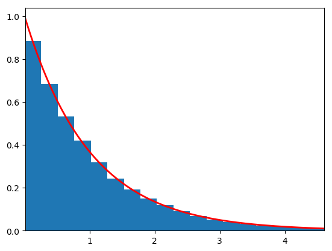

```{r setup, include=FALSE}
knitr::opts_chunk$set(echo = TRUE,warning = FALSE,message = FALSE)
```

ParticleFilterに到達する前の重点サンプリングやPMCMC(Particle Marcoh chain monte carlo)のもとになっているMCMCの理論について  
いろいろと怪しい部分があったのでまとめる。

## 参考文献

[Rによるモンテカルロ法入門](https://pub.maruzen.co.jp/book_magazine/book_data/search/9784621065273.html)  
[人工知能に関する断創録](http://aidiary.hatenablog.com/entry/20140620/1403272044)

# 逆変換法
乱数を得る手法の一つ。
[0,1]区間の一様分布から得られた乱数（一様乱数）を変換することで任意の確率分布に従う乱数を得る手法。
このとき必要となるのは変換先の確率分布の累積分布関数
(cumulative distribution function:cdf)  
逆変換法は、累積分布関数$F_X$の逆関数$F^{−1}_X$を使って一様乱数を変換する。
下の例は、一様乱数を指数分布の乱数に変換した例。

指数分布の累積分布関数の逆関数が
$$
\displaystyle x = - \frac{1}{\lambda} \log (1 - u)
$$
```{python}
# 逆変換法で一様分布から指数分布を得る
import numpy as np
import matplotlib.pyplot as plt
import scipy.stats

nbins = 50

# 指数分布のパラメータ（scale = 1/lambda）
scale = 1.0

# 逆変換法で一様乱数から指数分布の乱数を得る
np.random.seed()
N = 100000
U = scipy.stats.uniform(loc=0.0, scale=1.0).rvs(size=N)

# 指数分布の累積分布関数の逆関数を用いて変換
X1 = - scale * np.log(1 - U)

# 生成した元の一様乱数を描画
plt.figure(1)
plt.hist(U, nbins, normed=True)

# 変換した指数分布の乱数と理想的なPDFを描画
plt.figure(2)
rv = scipy.stats.expon(scale=scale)
plt.hist(X1, nbins, normed=True)
x = np.linspace(rv.ppf(0.01), rv.ppf(0.99), 1000)
y = rv.pdf(x)
plt.plot(x, y, 'r-', lw=2)
plt.xlim((rv.ppf(0.01), rv.ppf(0.99)))

#plt.show()
plt.savefig('figure/gyaku.png', bbox_inches='tight')
```

